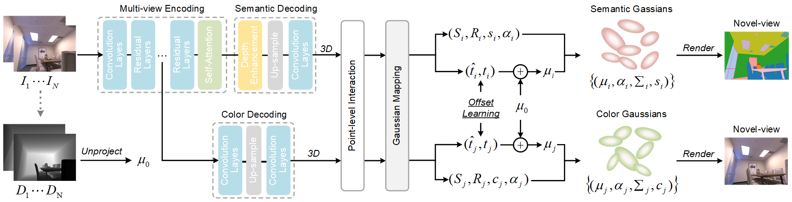

<div align="center">

# GSsplat: Generalizable Semantic Gaussian Splatting for Novel-view Synthesis in 3D Scenes
**Feng Xiao** · **Hongbin Xu** · **Wanlin Liang** · **Wenxiong Kang**  
*South China University of Technology*  

[Code](https://github.com/onmyoji-xiao/GSsplat) | [Paper](https://arxiv.org/abs/2505.04659) | [Project Page](#)  


</div>

## Environment
```
conda create -n gssplat python=3.10
conda activate gssplat

pip install torch==2.2.1 torchvision==0.17.1 --index-url https://download.pytorch.org/whl/cu121
pip install requirement.txt

cd submodules/diff-gaussian-rasterization
python setup.py install
```

